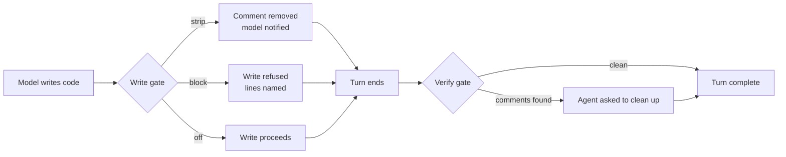

# comment-sicko

Stops models from filling code with comments. Three enforcement layers, toggleable per profile.

```
/comment-sicko status
/comment-sicko mode write-gate block
/comment-sicko enable sicko
```

## The problem

Models narrate code they just wrote. The same comment appears three times in three slightly different ways. The code explains itself; the comments just repeat it.

## Three layers



**Layer 1 — Write gate** intercepts `write_file` and `patch` before the code lands. Modes:

- `modify` — strips deletable comments, tells the model what was removed
- `block` — refuses the write, names the offending lines
- `off` / `audit` — observes without touching

**Layer 2 — Verify gate** rescans files edited this turn before the turn ends. Anything still removable is named `file:line` and the agent is asked to clean it up.

**Layer 3 — Comment Sicko reviewer** spawns a read-only subagent that audits the working diff. Reports `MUST KILL` flags naming the exact symbol that should be renamed, extracted, typed, or restructured instead. Off by default because it costs a model call.

## What counts as a comment worth removing

The six allowances that survive both gates:

1. Legal / licence header
2. Behaviour forced by something we cannot change (vendor, protocol, platform quirk, binding ADR)
3. Public API contract: docstrings on exported symbols, CLI usage, parameter contracts
4. Issue / ADR / ticket / `spec §7.3` link explaining a constraint code cannot express
5. Tool directive: `statement-breakpoint`, `# region`, `-- sourceMappingURL`
6. Formatter directive: `prettier-ignore`, `fmt: off`

When a comment is load-bearing and none of the six fits, the durable form is the cheapest in-scope test, type, or CI lint that fails when the rule breaks. Offer it; do not add the comment.

## Install

```bash
hermes plugins install comment-sicko
```

## Configure

```bash
hermes comment-sicko status                    # show all layers and modes
hermes comment-sicko mode write-gate block      # refuse writes with comments
hermes comment-sicko disable verify-gate        # turn off layer 2
hermes comment-sicko enable sicko               # turn on layer 3
hermes comment-sicko defaults set write_gate_mode block --profile research  # per-profile
```

Modes per layer: `off`, `modify`, `block`, `audit`. Settings live in `$HERMES_HOME/config.yaml`, and `$HERMES_HOME` is the profile, so each profile keeps its own defaults.

## What it does not do

- Does not scan code written through `terminal` or `execute_code` at write time; the verify gate catches those at turn end
- Does not remove comments inside string literals, shebangs, licence headers, or the six allowances above
- Does not call home, fetch updates, or replace its own files

## Verification

| Test | Result |
|------|--------|
| Scanner parity vs standalone `comment_audit.py` | 3,225 findings identical |
| Verdict parity (stripper vs classifier) | 17,553 spans, 0 mismatches |
| Skill shim vs original script | 4,742 findings identical |
| E2E write-gate live fire | Control provoked comments, gated run left none |
| `hermes plugins doctor` | 1 tool, 3 hooks registered |

## License

MIT